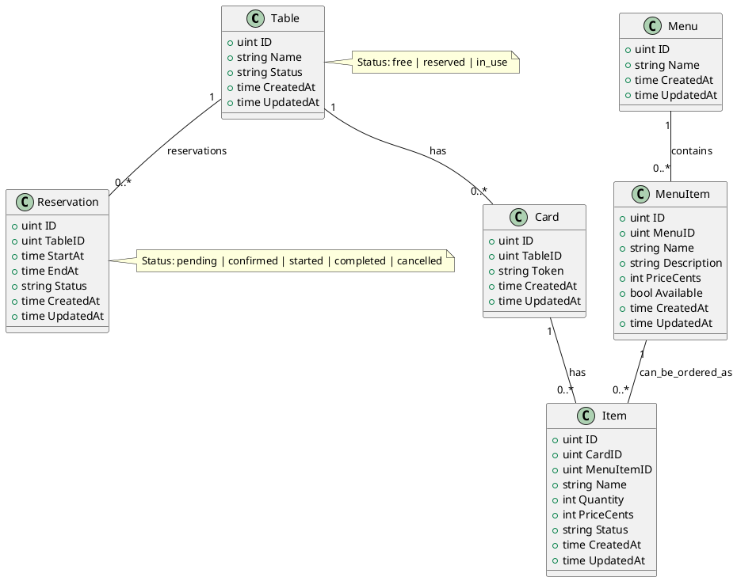

# Modelagem (PlantUML)

Este arquivo contém o diagrama de classes do domínio em PlantUML.

Para renderizar localmente, você pode usar uma extensão PlantUML no seu editor ou o site oficial do PlantUML.

Descrição rápida:
- `Table` representa uma mesa do restaurante.
- `Card` (cartão) é o pedido associado a uma `Table`.
- `Item` são os itens pedidos no `Card`.
- `Reservation` representa uma reserva de mesa com início/fim (calendarizada).

Menu e MenuItem:
- `Menu` agrupa os itens disponíveis (ex: "Almoço", "Bebidas").
- `MenuItem` representa um item do cardápio com preço e disponibilidade.

Relação com pedidos:
- `Item` pode referenciar um `MenuItem` via `MenuItemID` (opcional). Isso permite registrar o nome/price no momento do pedido e manter histórico mesmo se o cardápio mudar.

API relevante:
- `POST /reservations` — criar reserva
- `POST /reservations/{id}/checkin` — check-in (iniciar reserva)
- `POST /reservations/{id}/checkout` — check-out (finalizar reserva)
- `GET /tables/{id}/reservations` — listar reservas da mesa
