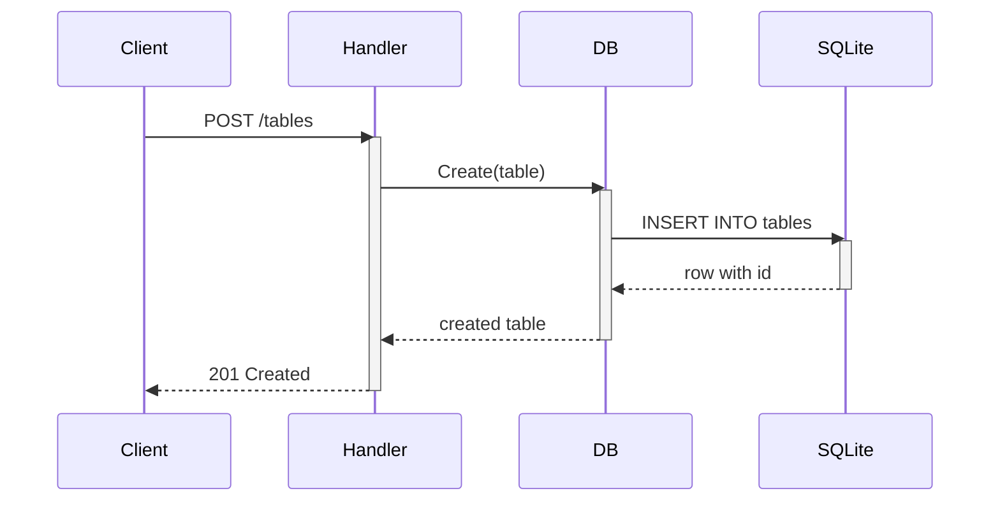

# 01 — Create Table

```mermaid
sequenceDiagram
    participant Client
    participant Handler
    participant DB
    participant SQLite

    Client->>Handler: POST /tables
    activate Handler
    Handler->>DB: Create(table)
    activate DB
    DB->>SQLite: INSERT INTO tables
    activate SQLite
    SQLite-->>DB: row with id
    deactivate SQLite
    DB-->>Handler: created table
    deactivate DB
    Handler-->>Client: 201 Created
    deactivate Handler
```
