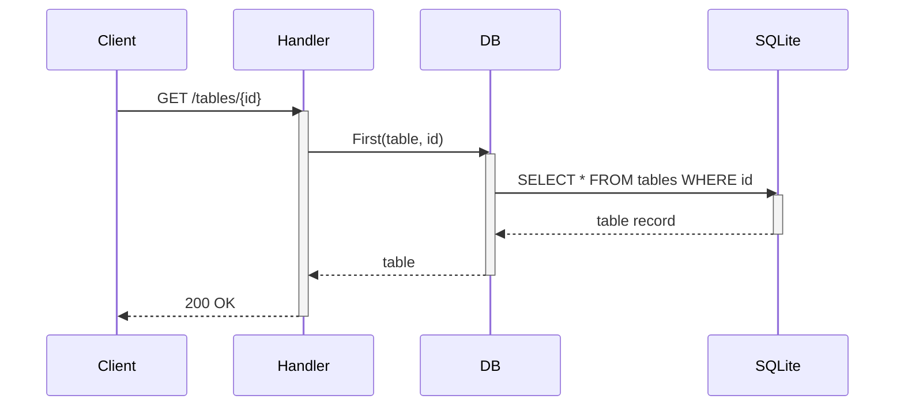

# 02 — Get Table

```mermaid
sequenceDiagram
    participant Client
    participant Handler
    participant DB
    participant SQLite

    Client->>Handler: GET /tables/{id}
    activate Handler
    Handler->>DB: First(table, id)
    activate DB
    DB->>SQLite: SELECT * FROM tables WHERE id
    activate SQLite
    SQLite-->>DB: table record
    deactivate SQLite
    DB-->>Handler: table
    deactivate DB
    Handler-->>Client: 200 OK
    deactivate Handler
```
