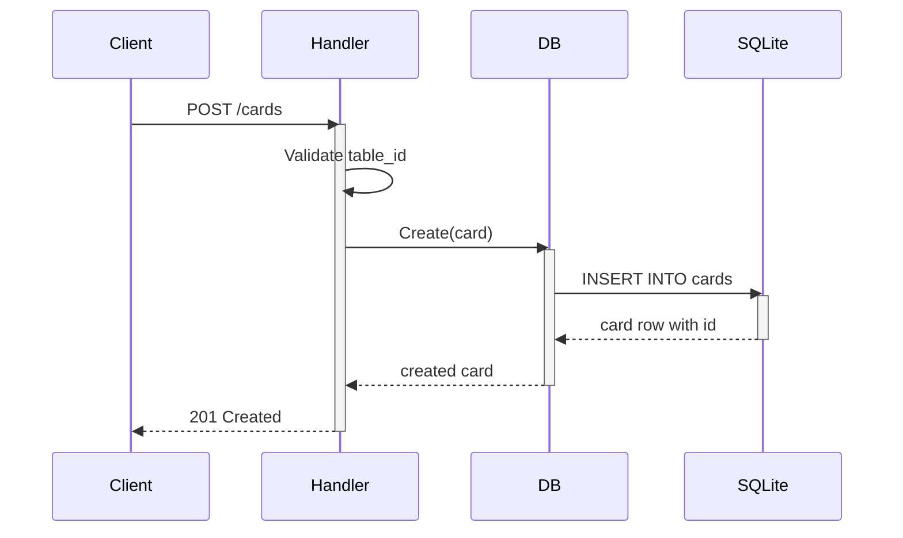

# 03 — Create Card

```mermaid
sequenceDiagram
    participant Client
    participant Handler
    participant DB
    participant SQLite

    Client->>Handler: POST /cards
    activate Handler
    Handler->>Handler: Validate table_id
    Handler->>DB: Create(card)
    activate DB
    DB->>SQLite: INSERT INTO cards
    activate SQLite
    SQLite-->>DB: card row with id
    deactivate SQLite
    DB-->>Handler: created card
    deactivate DB
    Handler-->>Client: 201 Created
    deactivate Handler
```
