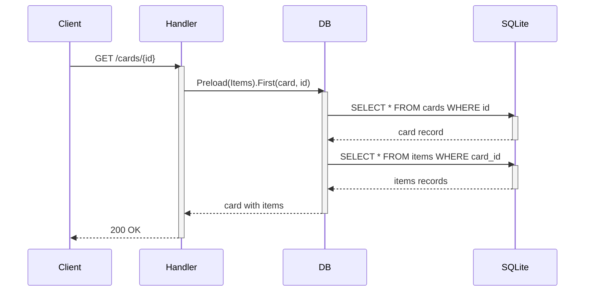

# 04 — Get Card with Items

```mermaid
sequenceDiagram
    participant Client
    participant Handler
    participant DB
    participant SQLite

    Client->>Handler: GET /cards/{id}
    activate Handler
    Handler->>DB: Preload(Items).First(card, id)
    activate DB
    DB->>SQLite: SELECT * FROM cards WHERE id
    activate SQLite
    SQLite-->>DB: card record
    deactivate SQLite
    DB->>SQLite: SELECT * FROM items WHERE card_id
    activate SQLite
    SQLite-->>DB: items records
    deactivate SQLite
    DB-->>Handler: card with items
    deactivate DB
    Handler-->>Client: 200 OK
    deactivate Handler
```
