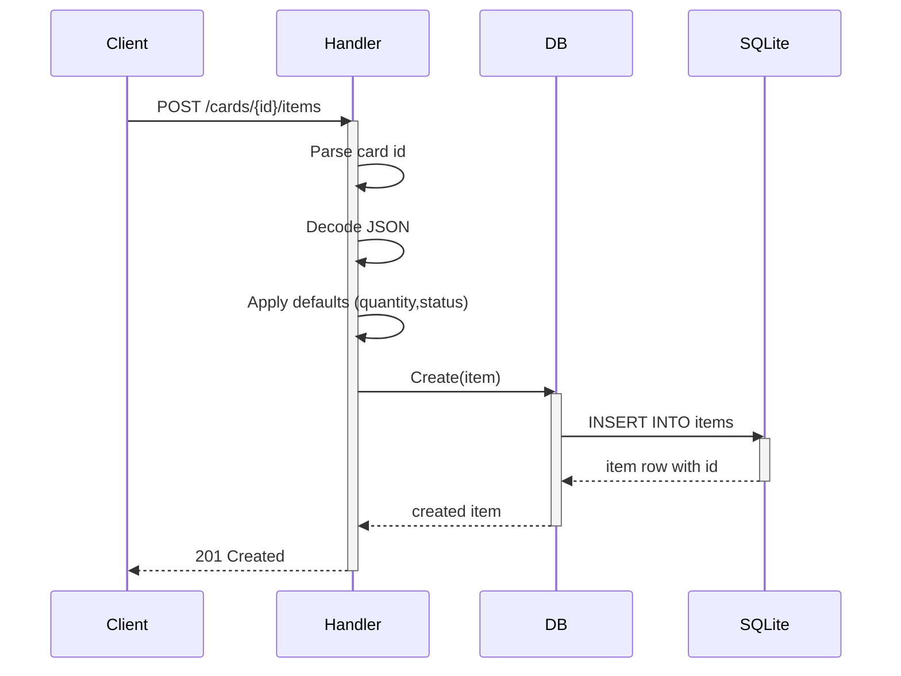

# 05 — Create Item

```mermaid
sequenceDiagram
    participant Client
    participant Handler
    participant DB
    participant SQLite

    Client->>Handler: POST /cards/{id}/items
    activate Handler
    Handler->>Handler: Parse card id
    Handler->>Handler: Decode JSON
    Handler->>Handler: Apply defaults (quantity,status)
    Handler->>DB: Create(item)
    activate DB
    DB->>SQLite: INSERT INTO items
    activate SQLite
    SQLite-->>DB: item row with id
    deactivate SQLite
    DB-->>Handler: created item
    deactivate DB
    Handler-->>Client: 201 Created
    deactivate Handler
```
