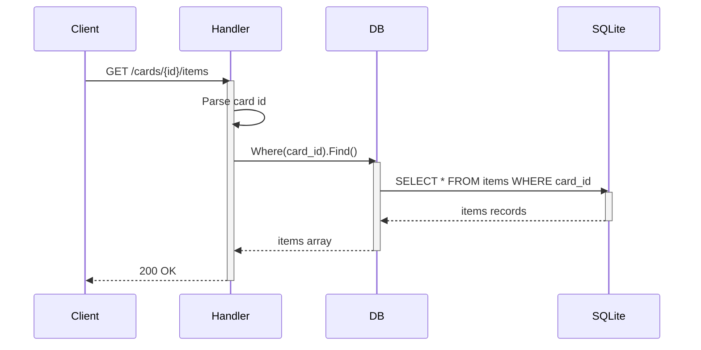

# 06 — List Items

```mermaid
sequenceDiagram
    participant Client
    participant Handler
    participant DB
    participant SQLite

    Client->>Handler: GET /cards/{id}/items
    activate Handler
    Handler->>Handler: Parse card id
    Handler->>DB: Where(card_id).Find()
    activate DB
    DB->>SQLite: SELECT * FROM items WHERE card_id
    activate SQLite
    SQLite-->>DB: items records
    deactivate SQLite
    DB-->>Handler: items array
    deactivate DB
    Handler-->>Client: 200 OK
    deactivate Handler
```
