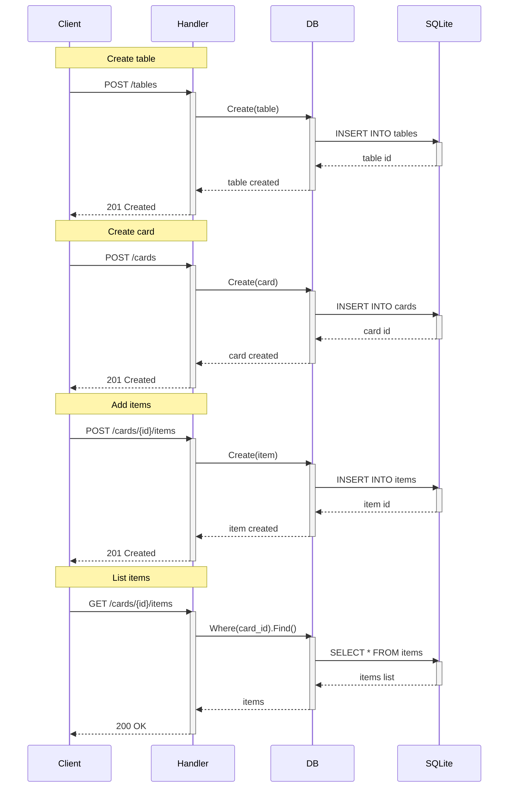

# 07 — Full Flow (Create Order for a Table)

```mermaid
sequenceDiagram
    participant Client
    participant Handler
    participant DB
    participant SQLite

    Note over Client,Handler: Create table
    Client->>Handler: POST /tables
    activate Handler
    Handler->>DB: Create(table)
    activate DB
    DB->>SQLite: INSERT INTO tables
    activate SQLite
    SQLite-->>DB: table id
    deactivate SQLite
    DB-->>Handler: table created
    deactivate DB
    Handler-->>Client: 201 Created
    deactivate Handler

    Note over Client,Handler: Create card
    Client->>Handler: POST /cards
    activate Handler
    Handler->>DB: Create(card)
    activate DB
    DB->>SQLite: INSERT INTO cards
    activate SQLite
    SQLite-->>DB: card id
    deactivate SQLite
    DB-->>Handler: card created
    deactivate DB
    Handler-->>Client: 201 Created
    deactivate Handler

    Note over Client,Handler: Add items
    Client->>Handler: POST /cards/{id}/items
    activate Handler
    Handler->>DB: Create(item)
    activate DB
    DB->>SQLite: INSERT INTO items
    activate SQLite
    SQLite-->>DB: item id
    deactivate SQLite
    DB-->>Handler: item created
    deactivate DB
    Handler-->>Client: 201 Created
    deactivate Handler

    Note over Client,Handler: List items
    Client->>Handler: GET /cards/{id}/items
    activate Handler
    Handler->>DB: Where(card_id).Find()
    activate DB
    DB->>SQLite: SELECT * FROM items
    activate SQLite
    SQLite-->>DB: items list
    deactivate SQLite
    DB-->>Handler: items
    deactivate DB
    Handler-->>Client: 200 OK
    deactivate Handler
```
