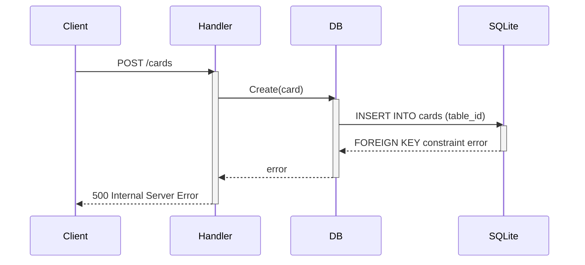

# 08 — Error: Create Card for Non-existent Table

```mermaid
sequenceDiagram
    participant Client
    participant Handler
    participant DB
    participant SQLite

    Client->>Handler: POST /cards
    activate Handler
    Handler->>DB: Create(card)
    activate DB
    DB->>SQLite: INSERT INTO cards (table_id)
    activate SQLite
    SQLite-->>DB: FOREIGN KEY constraint error
    deactivate SQLite
    DB-->>Handler: error
    deactivate DB
    Handler-->>Client: 500 Internal Server Error
    deactivate Handler
```
