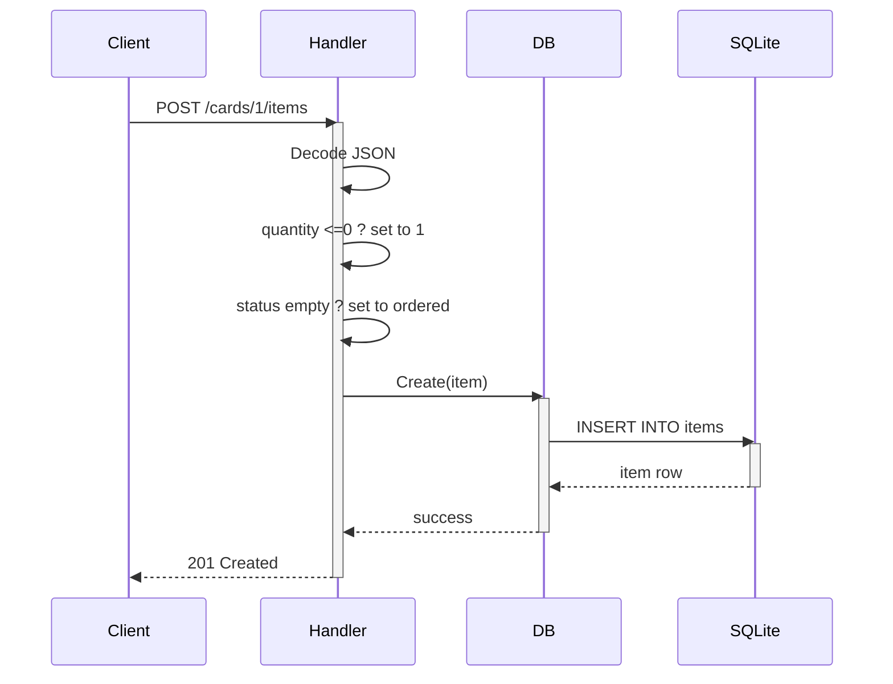

# 09 — Item Defaults

```mermaid
sequenceDiagram
    participant Client
    participant Handler
    participant DB
    participant SQLite

    Client->>Handler: POST /cards/1/items
    activate Handler
    Handler->>Handler: Decode JSON
    Handler->>Handler: quantity <=0 ? set to 1
    Handler->>Handler: status empty ? set to ordered
    Handler->>DB: Create(item)
    activate DB
    DB->>SQLite: INSERT INTO items
    activate SQLite
    SQLite-->>DB: item row
    deactivate SQLite
    DB-->>Handler: success
    deactivate DB
    Handler-->>Client: 201 Created
    deactivate Handler
```
