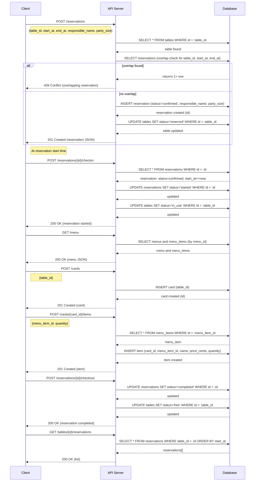

# 10 — Reservation Flow

```mermaid
sequenceDiagram
    participant Client
    participant API as API Server
    participant DB as Database

    %% Create reservation
    Client->>API: POST /reservations
    Note right of Client: {table_id, start_at, end_at, responsible_name, party_size}
    API->>DB: SELECT * FROM tables WHERE id = :table_id
    DB-->>API: table found
    API->>DB: SELECT reservations (overlap check for table_id, start_at, end_at)
    alt overlap found
        DB-->>API: returns 1+ row
        API-->>Client: 409 Conflict (overlapping reservation)
    else no overlap
        API->>DB: INSERT reservation (status='confirmed', responsible_name, party_size)
        DB-->>API: reservation created (id)
        API->>DB: UPDATE tables SET status='reserved' WHERE id = :table_id
        DB-->>API: table updated
        API-->>Client: 201 Created (reservation JSON)
    end

    %% Check-in flow (when guest arrives at start time)
    Note right of Client: At reservation start time
    Client->>API: POST /reservations/{id}/checkin
    API->>DB: SELECT * FROM reservations WHERE id = :id
    DB-->>API: reservation: status=confirmed, start_at<=now
    API->>DB: UPDATE reservations SET status='started' WHERE id = :id
    DB-->>API: updated
    API->>DB: UPDATE tables SET status='in_use' WHERE id = :table_id
    DB-->>API: updated
    API-->>Client: 200 OK (reservation started)

    %% After check-in: guest may fetch menu and order
    Client->>API: GET /menu
    API->>DB: SELECT menus and menu_items (by menu_id)
    DB-->>API: menu and menu_items
    API-->>Client: 200 OK (menu JSON)

    Client->>API: POST /cards
    Note right of Client: {table_id}
    API->>DB: INSERT card (table_id)
    DB-->>API: card created (id)
    API-->>Client: 201 Created (card)

    Client->>API: POST /cards/{card_id}/items
    Note right of Client: {menu_item_id, quantity}
    API->>DB: SELECT * FROM menu_items WHERE id = :menu_item_id
    DB-->>API: menu_item
    API->>DB: INSERT item (card_id, menu_item_id, name, price_cents, quantity)
    DB-->>API: item created
    API-->>Client: 201 Created (item)

    %% Check-out flow (when guest leaves)
    Client->>API: POST /reservations/{id}/checkout
    API->>DB: UPDATE reservations SET status='completed' WHERE id = :id
    DB-->>API: updated
    API->>DB: UPDATE tables SET status='free' WHERE id = :table_id
    DB-->>API: updated
    API-->>Client: 200 OK (reservation completed)

    %% Optional: list reservations for a table
    Client->>API: GET /tables/{id}/reservations
    API->>DB: SELECT * FROM reservations WHERE table_id = :id ORDER BY start_at
    DB-->>API: reservations[]
    API-->>Client: 200 OK (list)
```
